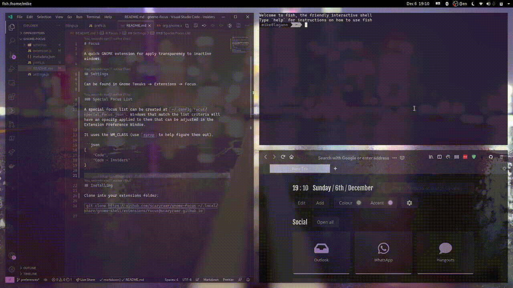

# Focus

A quick GNOME extension for apply transparency to inactive windows.



## Settings

Can be found in Gnome Tweaks -> Extensions -> Focus.

### Special Focus List

A special focus list can be created at `~/.config/Focus/special_focus.json`.

Windows that match the list criteria will have an opacity applied to them that can be adjusted in the Extension Preference Window.

It uses the WM_CLASS (use `xprop` to help figure them out).

```json
[
    "Code",
    "Code - Insiders"
]
```

## Ignore List

An ignore list can be created at `~/.config/Focus/ignore_focus.json`.

Windows that match the list criteria will not have their opacity modified even when inactive.

It uses the WM_CLASS (use `xprop` to help figure them out). The below example lets Firefox's Picture-in-Picture keep 100% opacity.

```json
[
    "Toolkit"
]
```

## Installing

[GNOME Extensions - Focus](https://extensions.gnome.org/extension/3924/focus/)

## Repo Guide

Thanks to [gjsify](https://gjsify.org/pages/projects) the build process has gotten a lot easier (no need to manually generate types using gobject-introspection), and you can actually build non-Linux systems. I recommend only installing on Linux though.

### Build

Currently, building doesn't produce expected errors (need to figure out [esbuild](https://esbuild.github.io/)).

```bash
yarn build
```

### Packaging for [GNOME Extensions](https://extensions.gnome.org/)

```bash
yarn build:package
```

### Installing Locally

```bash
yarn package:install
```
