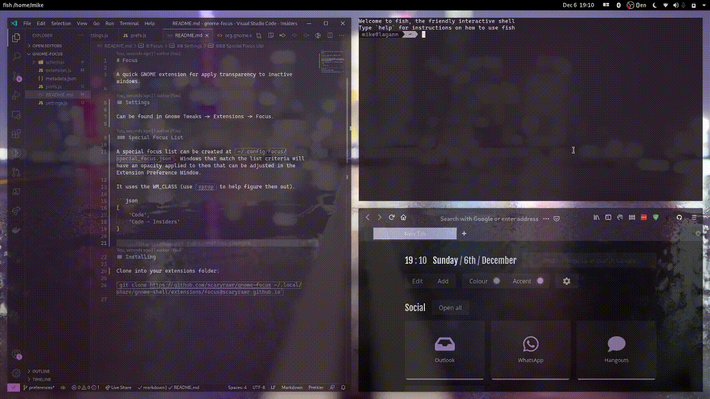

# Focus

A quick GNOME extension for apply transparency to inactive windows.



## Settings

Open Focus from the GNOME Extensions app to configure opacity, inactive-window effects, and exclusions.

### Excluded Windows

Use the **Excluded Windows** preferences page to add or remove exact criteria. A window is excluded when a criterion exactly matches any of:

- its `WM_CLASS`
- its `WM_CLASS` instance
- its full window title

Matching is case-sensitive. On X11, `xprop WM_CLASS` can show the class and instance; GNOME Shell's Looking Glass can help inspect windows on Wayland. Blank entries are not stored, duplicate entries are removed, and changes apply immediately while the extension is enabled.

### Special Focus List

A special focus list can be created at `~/.config/Focus/special_focus.json`.

Windows that match the list criteria will have an opacity applied to them that can be adjusted in the Extension Preference Window.

It uses the WM_CLASS (use `xprop` to help figure them out).

```json
[
    "Code",
    "Code - Insiders"
]
```

## Legacy Ignore List

An ignore list can be created at `~/.config/Focus/ignore_focus.json`.

Windows that match the list criteria will not have their appearance modified even when inactive.

The legacy list is still honored and merged with exclusions from preferences. Focus reads it without modifying or overwriting the file. Criteria use the same exact, case-sensitive `WM_CLASS`, instance, or full-title matching described above. The example below lets Firefox's Picture-in-Picture keep its normal appearance.

```json
[
    "Toolkit"
]
```

## Installing

[GNOME Extensions - Focus](https://extensions.gnome.org/extension/3924/focus/)

## Repo Guide

Thanks to [gjsify](https://gjsify.org/pages/projects) the build process has gotten a lot easier (no need to manually generate types using gobject-introspection), and you can actually build non-Linux systems. I recommend only installing on Linux though.

### Build

Currently, building doesn't produce expected errors (need to figure out [esbuild](https://esbuild.github.io/)).

```bash
yarn build
```

### Packaging for [GNOME Extensions](https://extensions.gnome.org/)

```bash
yarn build:package
```

### Installing Locally

```bash
yarn package:install
```
